## [RS School React Course](https://rs.school/courses/reactjs): React Performance

## Environmental Emissions Dashboard

## About the project

This is a React application for viewing and analyzing greenhouse gas emissions and climate data for countries around the world. The project was created as a learning assignment to demonstrate skills in optimizing the performance of React applications when working with large volumes of data.

## Performance Analysis

### Testing Actions

The following interactions were measured using React DevTools Profiler:

1. Sorting a column
2. Searching a country
3. Selecting another year
4. Adding/removing columns

### Before Optimization (Initial Version)

#### Performance Metrics Before Optimization

| Action                  | Commit Duration (ms) | Render Duration (ms) | Interaction Type |
| ----------------------- | -------------------- | -------------------- | ---------------- |
| Sorting column          | 2.9ms                | 173.4ms              | onClick          |
| Searching country       | 1.9ms                | 55.1ms               | onChange         |
| Selecting year          | 6ms                  | 210.8ms              | onChange         |
| Adding/removing columns | 1.3ms                | 25.2ms               | onClick          |

When Interactions tab data is unavailable, analysis is based on Commit Duration and Flame Graph timing comparisons.

#### Screenshots

##### Sorting a Column

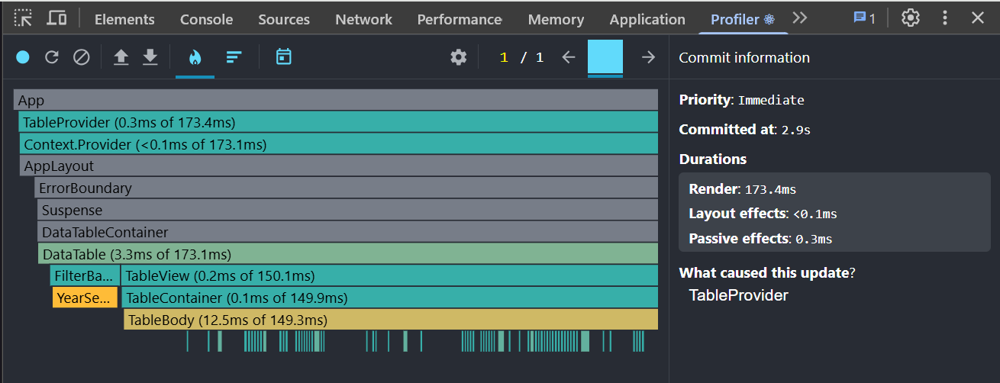
_Flame Graph for column sorting before optimization_

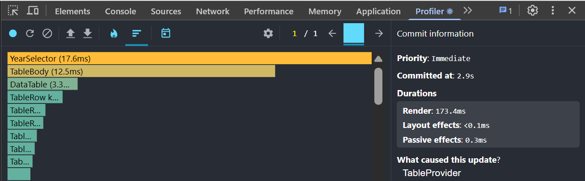
_Ranked Chart for column sorting before optimization_

##### Searching a Country

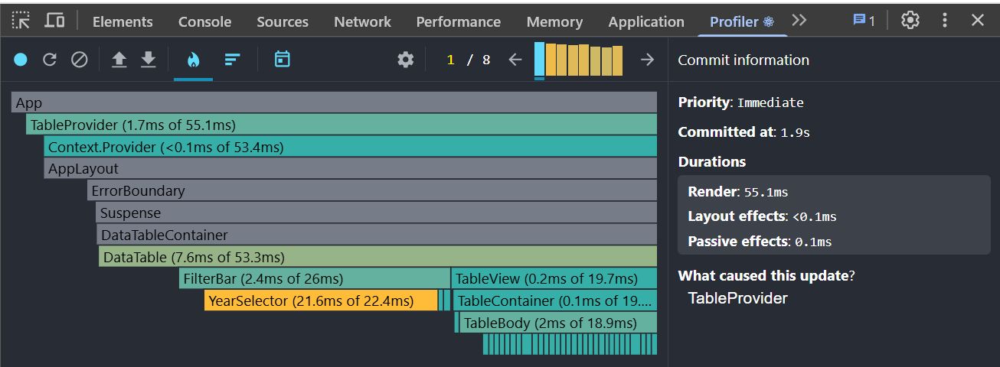
_Flame Graph for country search before optimization_

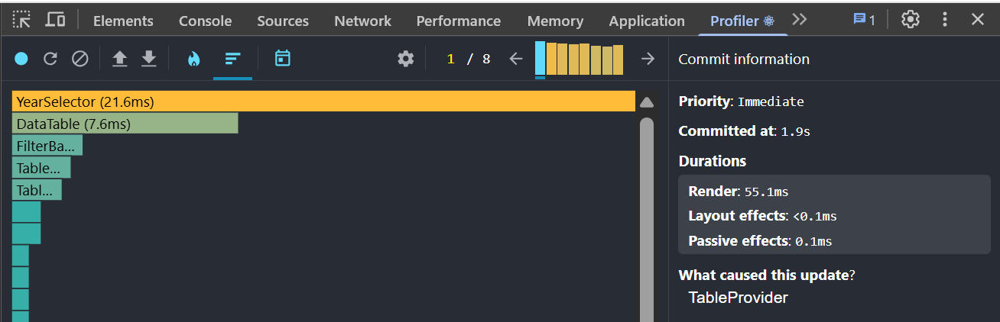
_Ranked Chart for country search before optimization_

##### Selecting Another Year

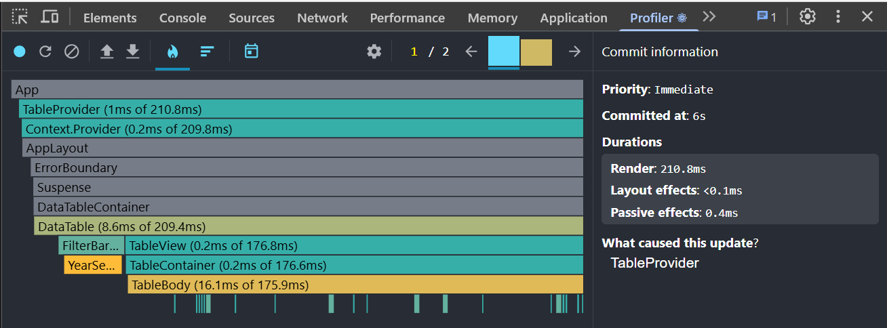
_Flame Graph for year selection before optimization_

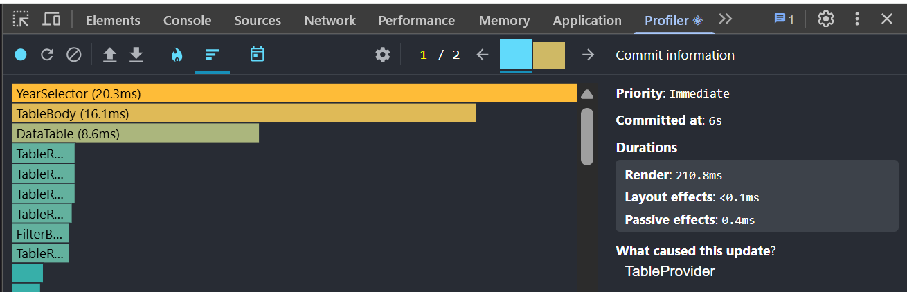
_Ranked Chart for year selection before optimization_

##### Adding/Removing Columns

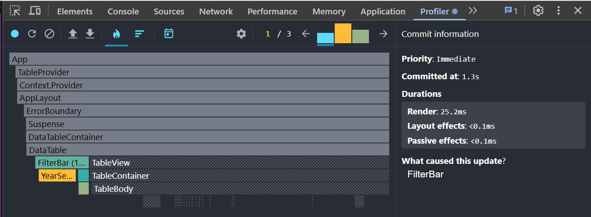
_Flame Graph for column management before optimization_

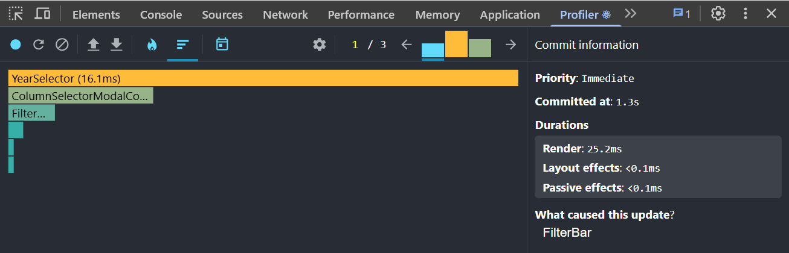
_Ranked Chart for column management before optimization_

#### Key Performance Issues

**Performance bottlenecks identified before optimization:**

- **Redundant data processing:** The `data-service.ts` performed full emissions data processing on every `loadEmissionsData()` call, including unnecessary object copying and population lookup operations
- **Lack of computation memoization:** Filtering, sorting, and searching operations were re-executed on every component re-render without caching results
- **Unnecessary component re-renders:** Child components were re-rendering even with unchanged props due to missing memoization
- **Non-optimized event handlers:** Functions were recreated on every render, causing unnecessary re-renders of child components
- **Missing search debouncing:** Search operations triggered on every character input without delay optimization

---

### After Optimization

#### Applied Optimizations

**1. Computation Memoization (useMemo):**

- Available years memoization in `useTableData`
- Base table rows and filtered data memoization
- Column calculations and styling memoization in `TableView`
- Table cell memoization in `useTableRowData`
- Context value memoization in `TableProvider`

**2. Event Handler Memoization (useCallback):**

- All functions in `TableProvider` wrapped with `useCallback`
- Filter component event handlers memoized
- Sorting and filtering functions memoized

**3. Component Re-render Prevention (React.memo):**

- Core components: `DataTable`, `TableView`, `TableHeader`, `TableBody`, `TableRow`
- Filter components: `FilterBar`, `YearSelector`, `SearchBar`, `SortControls`

**4. Additional Performance Improvements:**

- **Data service caching:** Processed data caching in `data-service.ts` with `processedDataCache`
- **Search debouncing:** 300ms delay to reduce search operation frequency
- **Algorithm optimization:** Improved search and sorting algorithms efficiency
- **Proper key props:** Correct key properties for lists and tables to avoid reconciliation issues

#### Performance Metrics After Optimization

| Action                  | Commit Duration (ms) | Render Duration (ms) | Interaction Type | Improvement  |
| ----------------------- | -------------------- | -------------------- | ---------------- | ------------ |
| Sorting column          | 1.4ms                | 113.6ms              | onClick          | 34.5% faster |
| Searching country       | 2.4ms                | 21.1ms               | onChange         | 61.7% faster |
| Selecting year          | 2.2ms                | 133.5ms              | onChange         | 36.7% faster |
| Adding/removing columns | 1.2ms                | 9ms                  | onClick          | 64.3% faster |

When Interactions tab data is unavailable, analysis is based on Commit Duration and Flame Graph timing comparisons.

#### Screenshots

##### Sorting a Column

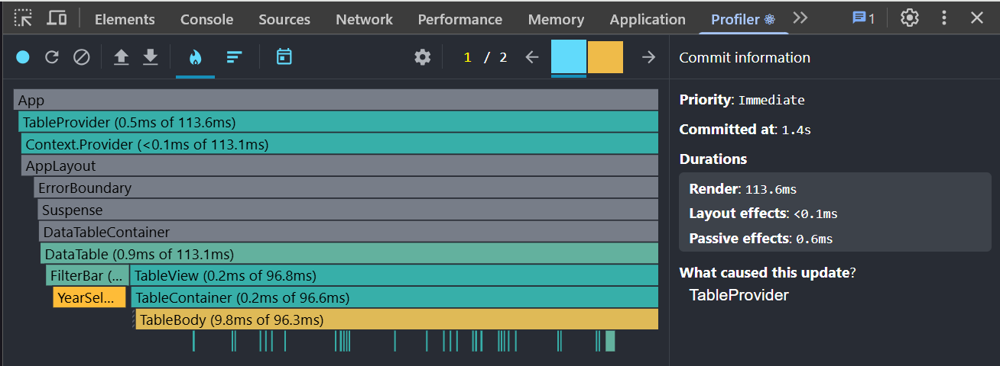
_Flame Graph for column sorting after optimization_

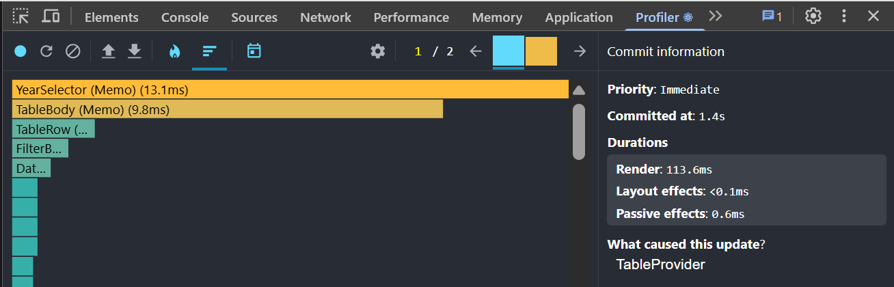
_Ranked Chart for column sorting after optimization_

##### Searching a Country

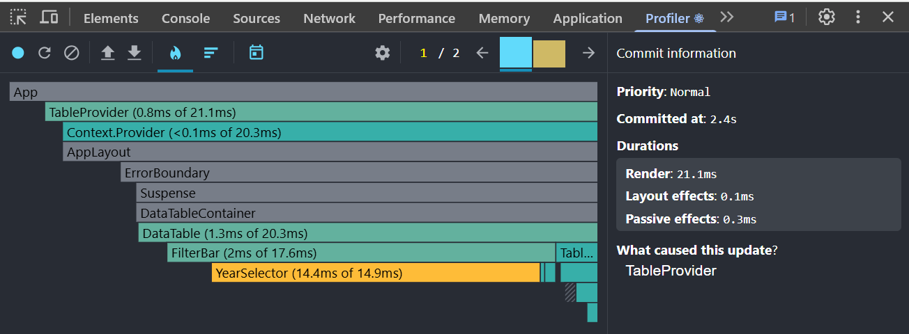
_Flame Graph for country search after optimization_

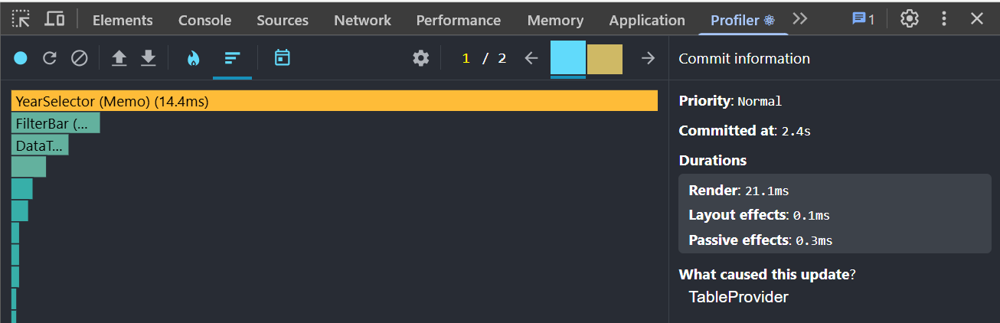
_Ranked Chart for country search after optimization_

##### Selecting Another Year

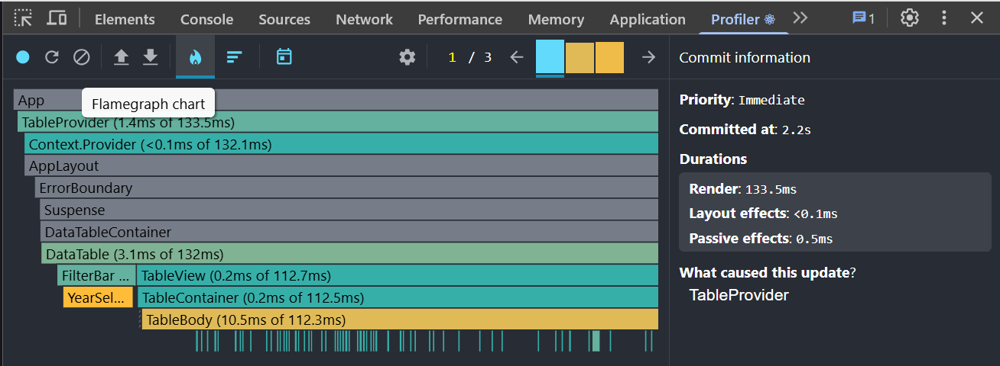
_Flame Graph for year selection after optimization_

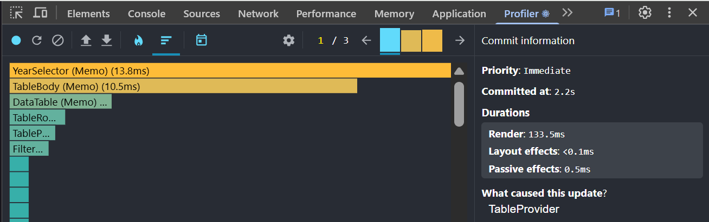
_Ranked Chart for year selection after optimization_

##### Adding/Removing Columns

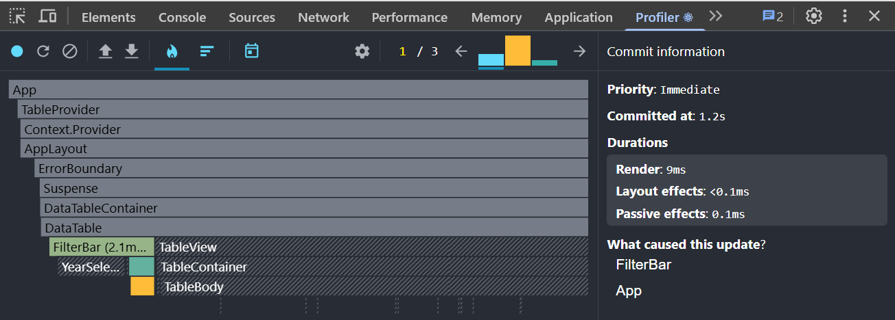
_Flame Graph for column management after optimization_

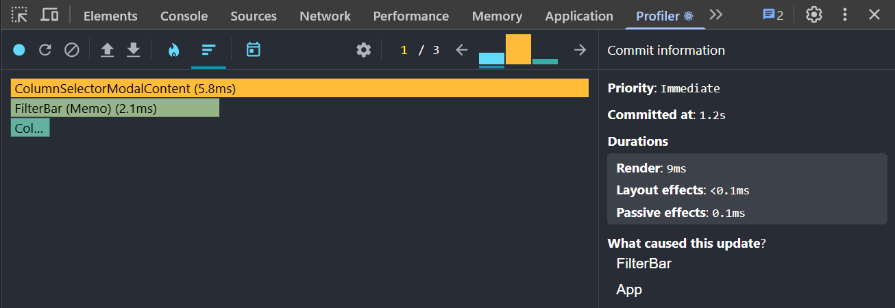
_Ranked Chart for column management after optimization_
